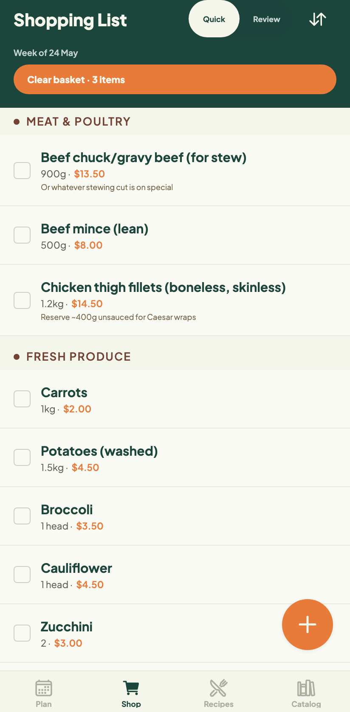
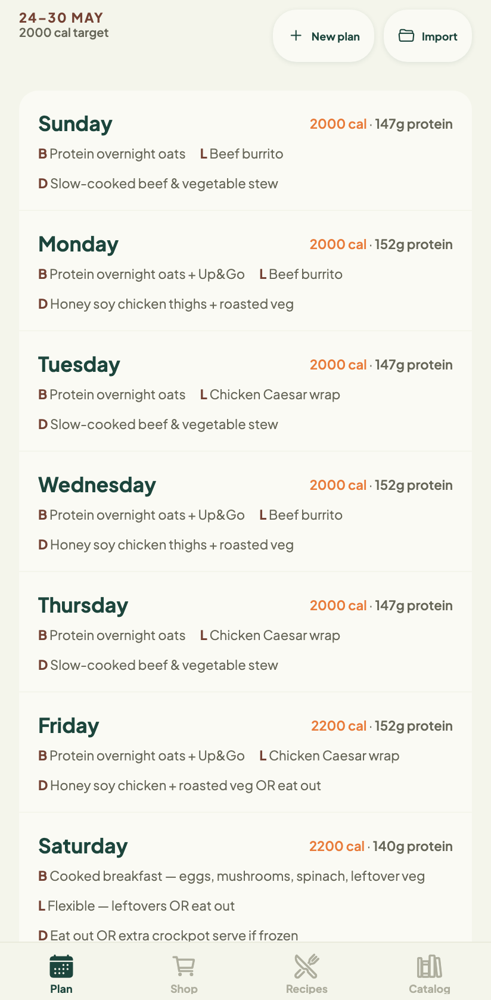
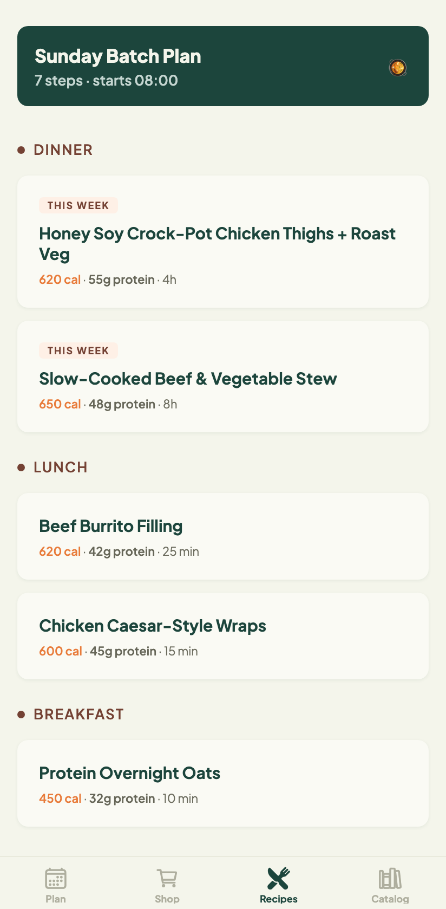
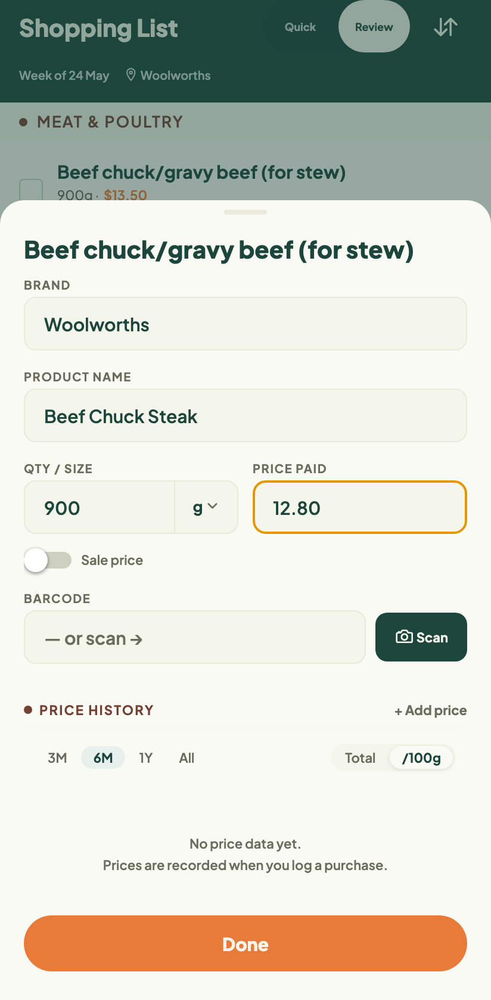
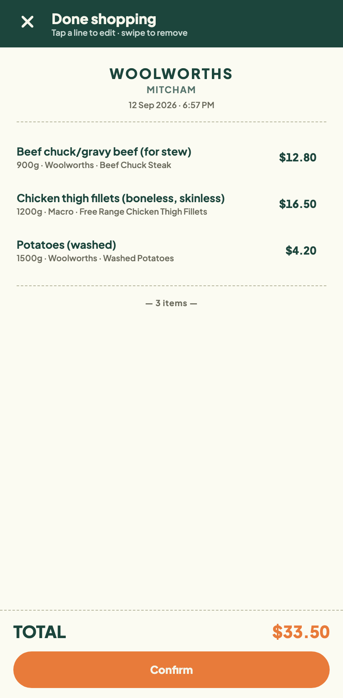
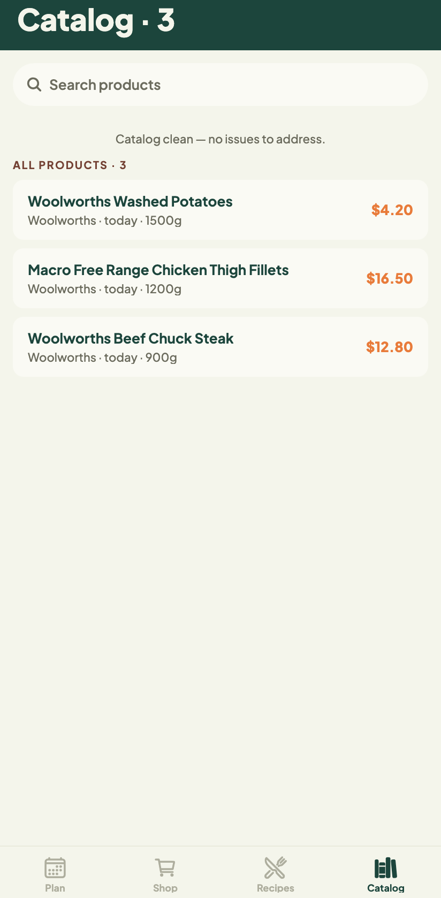
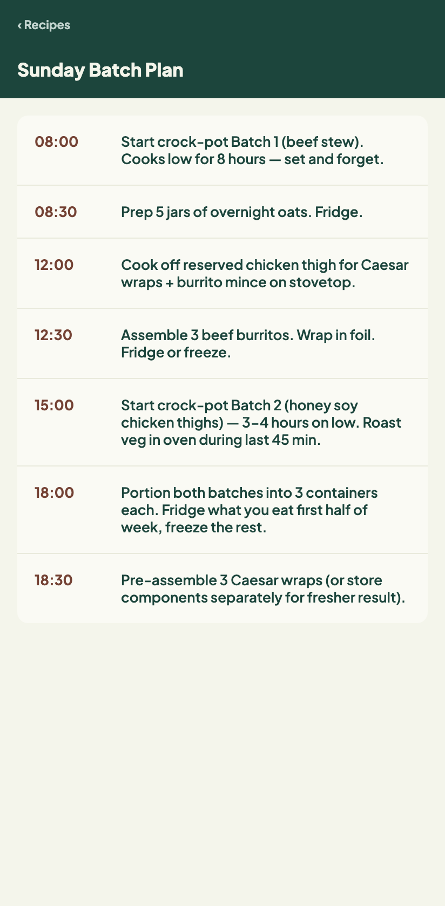

# Meal Planner

A personal meal planning and grocery app for one. Built for three moments: a
supermarket aisle with the phone in one hand, a Sunday afternoon of batch
cooking, and the occasional glance at what's for dinner.

Expo / React Native, SQLite on device, no backend and no account. All data
lives on the phone and leaves only through an explicit backup.

<table>
  <tr>
    <td align="center"><br><sub><b>Shop</b> — aisle order, prices, basket</sub></td>
    <td align="center"><br><sub><b>Plan</b> — the week at a glance</sub></td>
    <td align="center"><br><sub><b>Recipes</b> — the library, this week marked</sub></td>
  </tr>
  <tr>
    <td align="center"><br><sub><b>Capture</b> — what you actually bought</sub></td>
    <td align="center"><br><sub><b>Receipt</b> — the trip, before you commit it</sub></td>
    <td align="center"><br><sub><b>Catalog</b> — the price history behind it</sub></td>
  </tr>
</table>

Warm and homey rather than clinical: cream surfaces, a deep forest-green
header, terracotta for prices. Designed for a bright supermarket aisle, a
Sunday kitchen, and a couch — in that order.

## How the weekly loop works

The plan itself is authored by Claude, not by the app:

1. Paste the prompt in [`regenerate/HOW_TO_REGENERATE.md`](regenerate/HOW_TO_REGENERATE.md)
   into a fresh Claude conversation, along with `meal_plan.schema.json`.
2. Claude interviews you — calorie and protein targets, how many dinners to
   batch, the week's budget — and emits a `meal_plan.json` that validates
   against the schema.
3. Import that file in **Settings → Import Plan**. It becomes the active
   shopping list; the recipe library is preserved across imports.
4. Shop, cook, and capture real prices as you go. **Settings → Copy context for
   Claude** exports what you actually bought, so next week's plan can learn from
   it.

## The tabs

| Tab | What it's for |
| --- | --- |
| **Plan** | The week at a glance — each day's meals with its calorie and protein total |
| **Shop** | The list, grouped by category in your own aisle-walking order; check off in-store, capture prices, scan barcodes |
| **Recipes** | Every recipe ever imported; edit ingredients, tag nutrition, keep notes. The Sunday batch-cook schedule sits on top |
| **Catalog** | The product database behind it all — audit data quality, merge duplicates, track prices over time |

That batch-cook schedule is the hour-by-hour version of the week's plan:



## Running it

```sh
npm install
npm run android      # or: npm run ios
npm test             # jest, ~380 tests
npx tsc --noEmit     # typecheck
```

`ios/` and `android/` are gitignored — run `npx expo prebuild` if you need the
native projects regenerated.

## Working on it

Read [`AGENTS.md`](AGENTS.md) first. The short version: **Expo has changed** —
check the versioned docs at https://docs.expo.dev/versions/v56.0.0/ before
writing code against an Expo API, because the SDK 56 file-system and router
APIs differ from what most examples show.

- [`DESIGN.md`](DESIGN.md) — tokens and the rules that govern them. Orange is
  verbs and headline numbers; terracotta is labels. Neither is wallpaper.
  Never hard-code a colour, size, or font name — import from `constants/tokens.ts`.
- [`PRODUCT.md`](PRODUCT.md) — who this is for and why it looks the way it does.
- [`docs/superpowers/specs/`](docs/superpowers/specs/) — a design spec per
  feature, each with an `## Out of scope` section recording what was deferred
  and why. Worth reading before changing a feature.

### Data

SQLite via `expo-sqlite`, ten tables, currently at schema version 6. Migrations
are forward-only in `lib/db/migrations.ts`, keyed on `PRAGMA user_version` —
add a new numbered block, never edit an old one.

Changing the plan format is a three-step protocol: bump
`regenerate/meal_plan.schema.json`, update `meal_plan.types.ts`, and keep the
back-compat fallbacks in the importer so older `meal_plan.json` files still load.

`REFERENCES` in the schema are documentary — foreign keys are not enforced yet.

### Backups

**Settings → Save to device** writes the whole database as JSON to a folder you
pick, remembered for next time. **Share** sends the same file through the system
share sheet. Restore replaces everything, so it asks first.

One gap worth knowing: the aisle-walking order lives in AsyncStorage, not
SQLite, so it is *not* in the backup and does not survive a reinstall.
